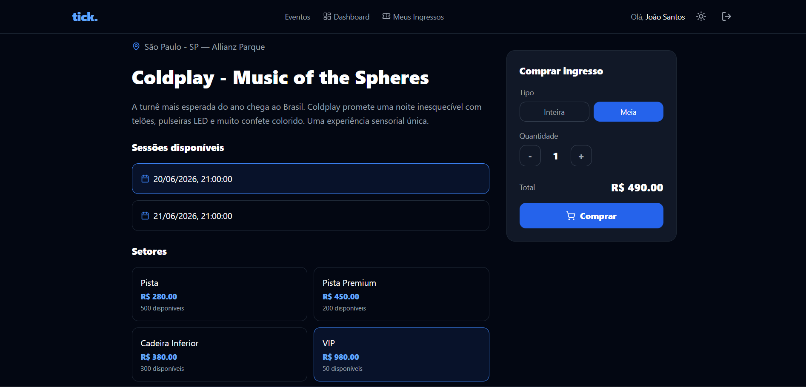
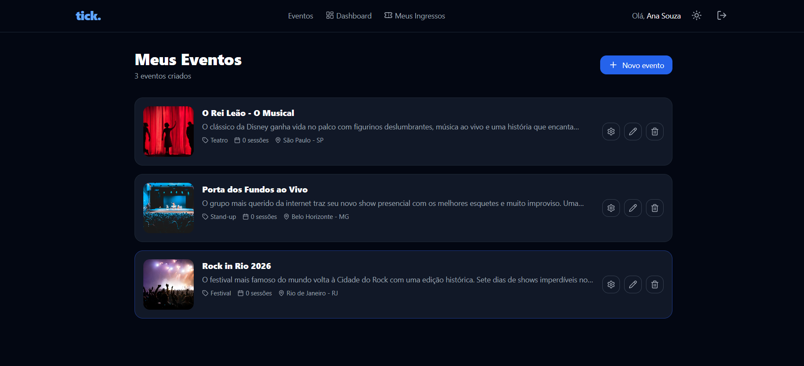
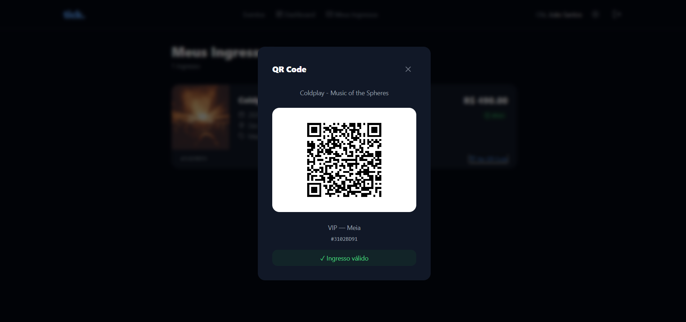
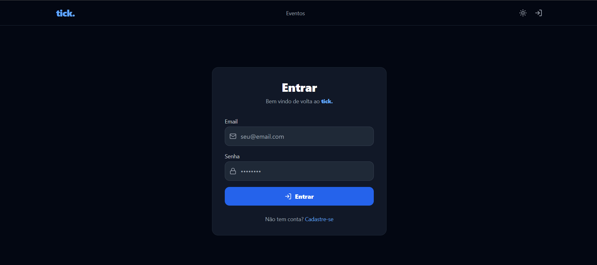

# tick. 🎟️

Bilheteria digital full-stack desenvolvida com Node.js, React e PostgreSQL.

## 📸 Screenshots







## 🚀 Tecnologias

**Back-end**

- Node.js + Express
- PostgreSQL + Prisma ORM
- JWT + Bcrypt
- REST API

**Front-end**

- React
- React Router DOM
- Tailwind CSS
- Axios
- Lucide React
- QRCode.react

## ✨ Funcionalidades

**Público**

- Listagem de eventos
- Visualização de detalhes do evento

**Produtor**

- Criar, editar e remover eventos
- Gerenciar sessões e setores
- Acompanhar vendas e receita em tempo real

**Consumidor**

- Comprar ingressos (inteira ou meia entrada)
- Visualizar ingressos com QR Code
- Gerenciar seus ingressos

**Geral**

- Autenticação completa (JWT)
- Dark/Light mode
- Layout responsivo

## 🗂️ Estrutura do projeto

```txt
tick/
│
├── server/                         # API REST (Node.js + Express)
│   ├── prisma/
│   └── src/
│       ├── config/
│       ├── controllers/
│       ├── middlewares/
│       └── routes/
│
└── client/                         # Frontend React
    └── src/
        ├── components/
        ├── contexts/
        ├── pages/
        └── services/
```

## ⚙️ Como rodar localmente

**Pré-requisitos**

- Node.js 18+
- PostgreSQL ou conta no Neon.tech

**Back-end**

```bash
cd server
npm install
# configure o .env com DATABASE_URL e JWT_SECRET
npx prisma migrate dev
npm run dev
```

**Front-end**

```bash
cd client
npm install
npm start
```

## 🔑 Variáveis de ambiente

Crie um arquivo `.env` dentro de `server/`:

PORT=3001
DATABASE_URL=sua_url_do_postgresql
JWT_SECRET=sua_chave_secreta

## 📡 Endpoints principais

| Método | Rota                             | Descrição        | Auth |
| ------ | -------------------------------- | ---------------- | ---- |
| POST   | /auth/register                   | Cadastro         | ❌   |
| POST   | /auth/login                      | Login            | ❌   |
| GET    | /events                          | Listar eventos   | ❌   |
| POST   | /events                          | Criar evento     | ✅   |
| GET    | /events/my                       | Meus eventos     | ✅   |
| PUT    | /events/:id                      | Editar evento    | ✅   |
| DELETE | /events/:id                      | Deletar evento   | ✅   |
| POST   | /events/:id/sessions             | Criar sessão     | ✅   |
| POST   | /events/:id/sessions/:id/sectors | Criar setor      | ✅   |
| POST   | /tickets/buy                     | Comprar ingresso | ✅   |
| GET    | /tickets/my                      | Meus ingressos   | ✅   |

## 👨‍💻 Autor

Feito por **José Antônio Júnior**

[](https://www.linkedin.com/in/jose-antonio-junior)
[](https://github.com/joseantoniojr)
